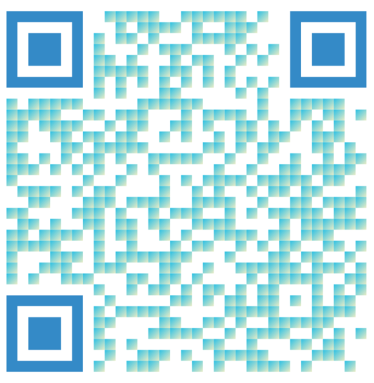

# QR Code Generator for React and React Native

Customizable QR code generated for React &amp; React Native.


This project was inspired by [react-native-qrcode-svg](https://github.com/awesomejerry/react-native-qrcode-svg).

## Install

With Yarn

```bash
yarn add react-fancy-qrcode
```

Or with npm

```bash
npm install -S react-fancy-qrcode
```

For React native and iOS, you'll need to perform a pod-install:

```bash
npx pod-install ios
```

## Example

```jsx
<QRCode
  value={"https://github.com/jgillick/react-fancy-qrcode"}
  size={400}
  dotScale={0.8}
  dotRadius="50%"
  positionRadius={["5%", "1%"]}
  errorCorrection="H"
  logo={require("images/fire.png")}
/>
```


## Saving QR Code Image

_**React native only!**_ (see caveat below)

### React Native

You can use the react ref to download the image data from the QR code SVG.

```jsx
import React, { useCallback, useRef } from 'react';
import QRCode, { QRCodeRef } from 'react-fancy-qrcode';

function RenderQRCode() {

  const svgRef = useRef<QRCodeRef>();
  const download = useCallback(() => {
    svgRef.current?.toDataURL((data) => {
      console.log(data);
    })
  }, [svgRef.current])

  return (
    <QRCode
      ref={svgRef}
      value={"https://github.com/jgillick/react-fancy-qrcode"}
      size={400}
    />
  )
}

```

### Web

On web you cannot export the binary SVG data, but you can get the SVG source.

```jsx
import React, { useCallback, useRef } from 'react';
import QRCode, { QRCodeRef } from 'react-fancy-qrcode';

function RenderQRCode() {

  const svgRef = useRef<QRCodeRef>();
  const download = useCallback(() => {
    const svgSource = svgRef.current?.outerHTML;
    console.log(svgSource)
  }, [svgRef.current])

  return (
    <QRCode
      ref={svgRef}
      value={"https://github.com/jgillick/react-fancy-qrcode"}
      size={400}
    />
  )
}

```

## Props

| Name                      | Default                        | Description                                                                                                     |
| ------------------------- | ------------------------------ | --------------------------------------------------------------------------------------------------------------- |
| value                     | `""`                           | The value to encode into the QR code                                                                            |
| size                      | 100                            | The pixel width/height of the generated QR code                                                                 |
| margin                    | 0                              | Space around the QR code (useful if you're generating an image with it)                                         |
| logo                      | -                              | Logo image to place in the center of the QR code (either `{uri: 'base64string'}` or `require('pathToImage')`)   |
| logoSize                  | -                              | The size your logo should be. Defaults to 20% of the `size` prop.                                               |
| backgroundColor           | white                          | The QR code background color                                                                                    |
| color                     | white                          | Primary color of the QR code dots. If this is an array of strings, it's treated as a linear gradient            |
| colorGradientDirection    | `['0%', '0%', '100%', '100%']` | If `color` is defined as a linear gradient, this defines the gradient direction. Array format: [x1, y1, x2, y2] |
| positionColor             | -                              | Color of the positioning squares in the top-left, top-right, and bottom-left. Defaults to the `color` property  |
| positionGradientDirection | ['0%', '0%', '100%', '100%']   | See `colorGradientDirection` explanation.                                                                       |
| positionRadius            | 0                              | The radius of the positioning pattern squares. See examples below.                                              |
| dotScale                  | 1                              | Reduce the QR code dot size by setting this to a value between `.1 - 1`.                                        |
| dotRadius                 | 0                              | The corner radius of each dot as a pixel or percent                                                             |
| errorCorrection           | M                              | QR Code error correction mode                                                                                   |

## positionRadius Prop - Positioning Pattern Square Corner Radius

The three large squares in the QR code (top-left, top-right, bottom-left) are used by QR code readers to determine the position of the QR code.
NOTE: If you customize the squares too much, QR code readers might not recognize the QR code.

If defined as a single pixel/percent value, this will be used for all 3 patters, both outside and inside squares.

```jsx
<QRCode
  positionRadius="5%"
  value={"https://github.com/jgillick/react-fancy-qrcode"}
  size={400}
/>
```

If defined as an array, the first index is for the outer square and the second is for the inner square of each pattern.

```jsx
<QRCode
  positionRadius={["20%", 10]}
  value={"https://github.com/jgillick/react-fancy-qrcode"}
  size={400}
/>
```

You can also define each radius as an object with an rx and ry value ([learn more](https://developer.mozilla.org/en-US/docs/Web/SVG/Attribute/ry))

```jsx
<QRCode
  positionRadius={{ rx: "5%", ry: "10%" }}
  value={"https://github.com/jgillick/react-fancy-qrcode"}
  size={400}
/>
```

or

```jsx
<QRCode
  positionRadius={[
    { rx: "5%", ry: "10%" },
    { rx: 1, ry: 20 },
  ]}
  value={"https://github.com/jgillick/react-fancy-qrcode"}
  size={400}
/>
```

# Linear Gradient

```jsx
<QRCode
  value={"https://github.com/jgillick/react-fancy-qrcode"}
  size={300}
  color={["#2BC0E4", "#EAECC6"]}
  positionColor="#348AC7"
/>
```


